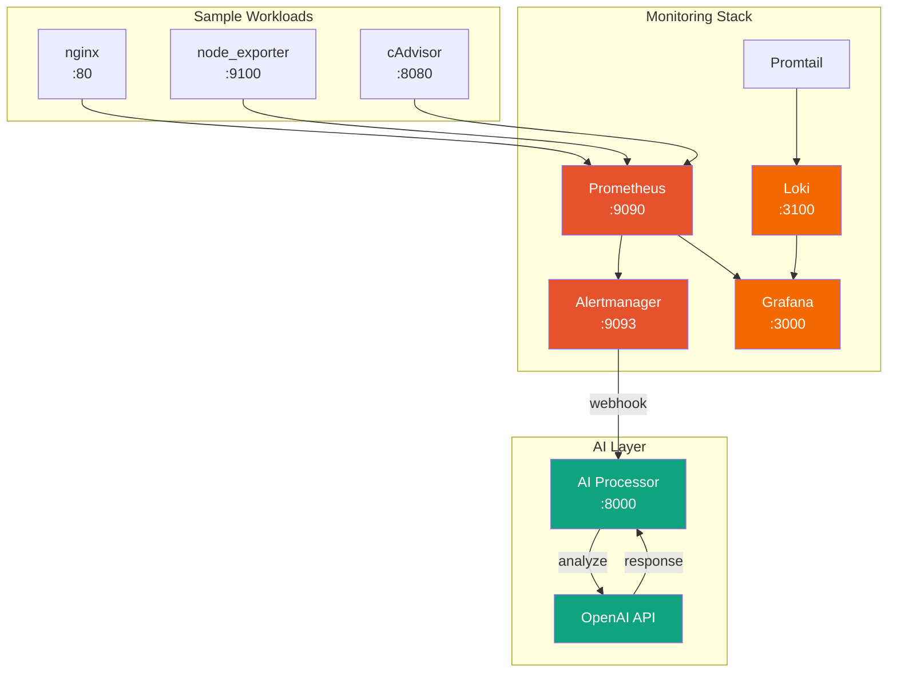
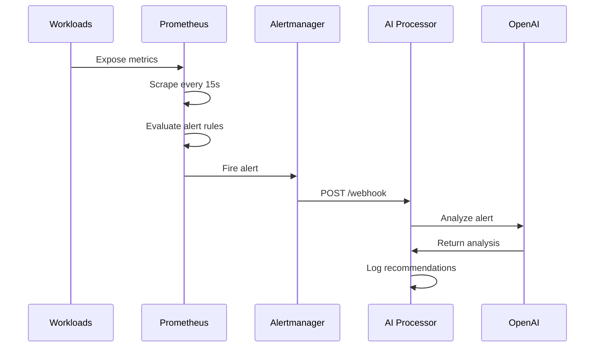

# AIOps Demo Platform

AI-powered infrastructure monitoring and alert analysis platform. Demonstrates DevOps skills with a complete observability stack and AI integration.

## Architecture



### Data Flow



## Quick Start

### Prerequisites

- Docker Desktop (8GB+ RAM)
- OpenAI API key (optional, for AI analysis)

### Local Development

```bash
# 1. Clone and setup
cd aiops-platform
cp .env.example .env
# Edit .env with your OpenAI API key (optional)

# 2. Start the stack
docker-compose up -d

# 3. Access services
# Grafana:      http://localhost:3000 (admin/admin123)
# Prometheus:   http://localhost:9090
# Alertmanager: http://localhost:9093
# AI Processor: http://localhost:8000
```

### Verify Installation

```bash
# Check all containers are running
docker-compose ps

# Test AI processor health
curl http://localhost:8000/health

# View Prometheus targets
open http://localhost:9090/targets
```

## Features

- **Metrics Collection**: Prometheus scraping nginx, node_exporter, cAdvisor
- **Log Aggregation**: Loki + Promtail for centralized logging
- **Visualization**: Grafana with pre-configured datasources
- **Alerting**: Alertmanager with webhook to AI processor
- **AI Analysis**: OpenAI-powered alert analysis and recommendations

## Project Structure

```
aiops-platform/
├── docker-compose.yml          # Local development orchestration
├── .env.example                # Environment template
├── monitoring/
│   ├── prometheus/
│   │   ├── prometheus.yml      # Scrape configs
│   │   └── alerts/rules.yml    # Alert rules
│   ├── grafana/provisioning/   # Datasource configs
│   ├── alertmanager/           # Alert routing
│   └── loki/                   # Log aggregation
├── ai-processor/               # FastAPI + OpenAI
│   ├── Dockerfile
│   ├── requirements.txt
│   └── app/
│       ├── main.py             # Webhook endpoints
│       └── llm_client.py       # OpenAI integration
└── infra/                      # OpenTofu for GCP
    ├── main.tf                 # Cloud Run + Artifact Registry
    ├── variables.tf
    └── outputs.tf
```

## GCP Deployment (Optional)

Deploy the AI Processor to Cloud Run for cloud-based analysis.

### Prerequisites

- GCP account with billing enabled
- gcloud CLI installed
- OpenTofu CLI (`brew install opentofu`)

### Deploy

```bash
cd infra

# 1. Authenticate with GCP
gcloud auth application-default login

# 2. Configure variables
cp terraform.tfvars.example terraform.tfvars
# Edit terraform.tfvars with your project ID

# 3. Initialize and deploy
tofu init
tofu plan
tofu apply

# 4. Get the service URL
tofu output service_url
```

## Testing Alerts

```bash
# Trigger a test alert by stopping a container
docker stop nginx

# Watch Alertmanager for firing alerts
open http://localhost:9093

# Check AI processor logs for analysis
docker logs -f ai_processor
```

## Stack Components

| Component | Port | Purpose |
|-----------|------|---------|
| Prometheus | 9090 | Metrics collection & storage |
| Grafana | 3000 | Visualization & dashboards |
| Alertmanager | 9093 | Alert routing & grouping |
| Loki | 3100 | Log aggregation |
| AI Processor | 8000 | Alert analysis with OpenAI |
| nginx | 80 | Sample workload |
| node_exporter | 9100 | Host metrics |
| cAdvisor | 8080 | Container metrics |

## Cost

- **Local**: $0 (runs on your machine)
- **GCP Cloud Run**: $0 (within free tier limits)
  - 2M requests/month free
  - Scales to zero when idle

## Skills Demonstrated

- Infrastructure as Code (OpenTofu/Terraform)
- Container orchestration (Docker Compose)
- Observability stack (Prometheus, Grafana, Loki)
- Cloud deployment (GCP Cloud Run)
- API development (FastAPI)
- AI/LLM integration (OpenAI)

## License

MIT
